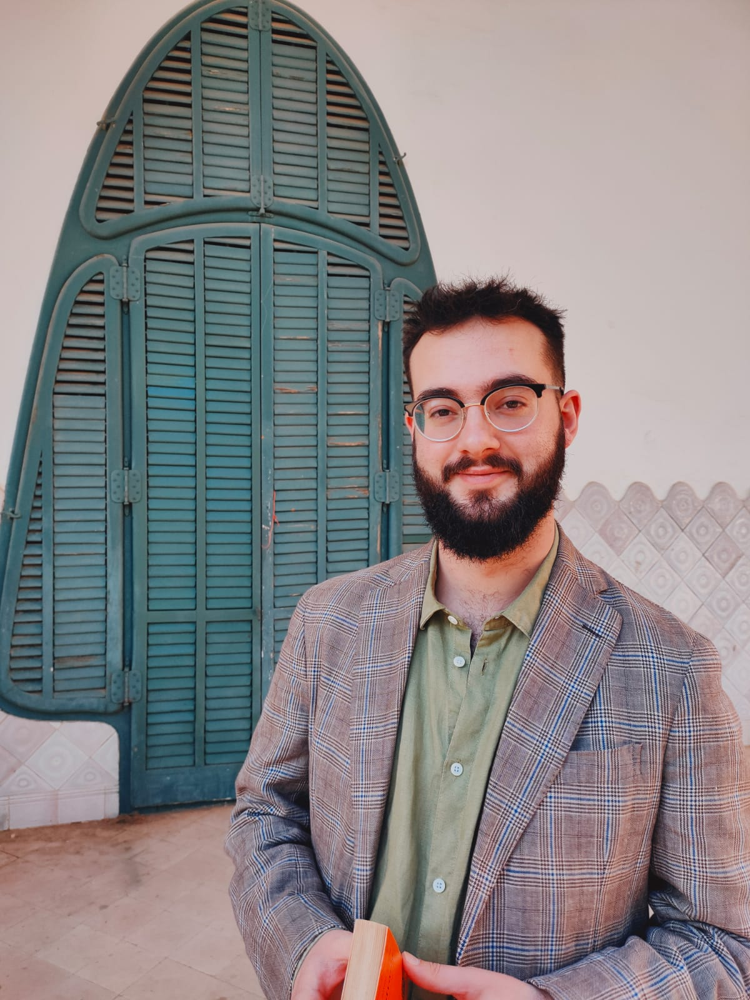

<p align="justify">

Welcome all!

</p>

<p align="justify">

I'm Bernat Puertas, a PhD candidate in the Department of Political and Social Sciences at [Universitat Pompeu Fabra de Barcelona (UPF)](https://www.upf.edu/web/politiques/). I'm a teaching assistant at Institut Barcelona d'Estudis Internacionals ([IBEI](https://www.ibei.org/en)) and member of the [Institutions and Political Actors Research Group](https://www.upf.edu/web/institucions-i-actors-politics) at UPF. I also work as a Research Assistant in the Linguatrust Project (PRE150/22/000008), funded by the Institut d’Estudis d’Autogovern, a joint project between Universitat de Barcelona, Universitat Pompeu Fabra, Universitat Oberta de Catalunya and Universitat de València.

</p>

<p align="justify">

The title of my [PhD project](thesis.html) is “Pathways to Personalism in Autocratic Regimes: Domestic and Foreign Factors”. It focuses on the domestic and foreign factors that can make personalism rise in dictatorships. My lines of research are comparative politics, comparative political economy, autocratic politics, democratization and quantitative methods.

</p>

<p align="justify">

I hold a BA in Political and Administration Sciences (2020) and an MA in Current Democracies: Nationalism, Federalism and Multiculturalism (2021), both from Universitat Pompeu Fabra.

</p>

<p align="justify">

In my spare time, I enjoy playing the guitar and mountaineering.

</p>

<p align="justify">

You can [email me](mailto:bernat.puertas@upf.edu) and you'll find me at Universitat Pompeu Fabra, Campus de la Ciutadella, Office 20.135. You can also check my [Google Scholar](https://scholar.google.es/citations?user=0jGbQHkAAAAJ&hl=es&authuser=3) profile and my [Twitter](https://twitter.com/bernat_puertas).

</p>

```{r eval=FALSE, include=FALSE}
#and google scholar# 
```

```{r me, echo=FALSE, fig.align='center', fig.dim=c(4,2), out.width = "50%"}

```
